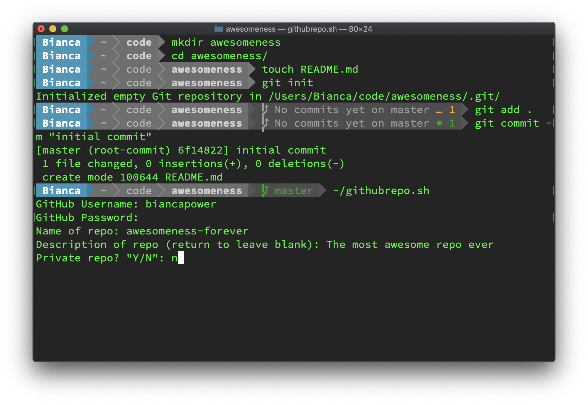
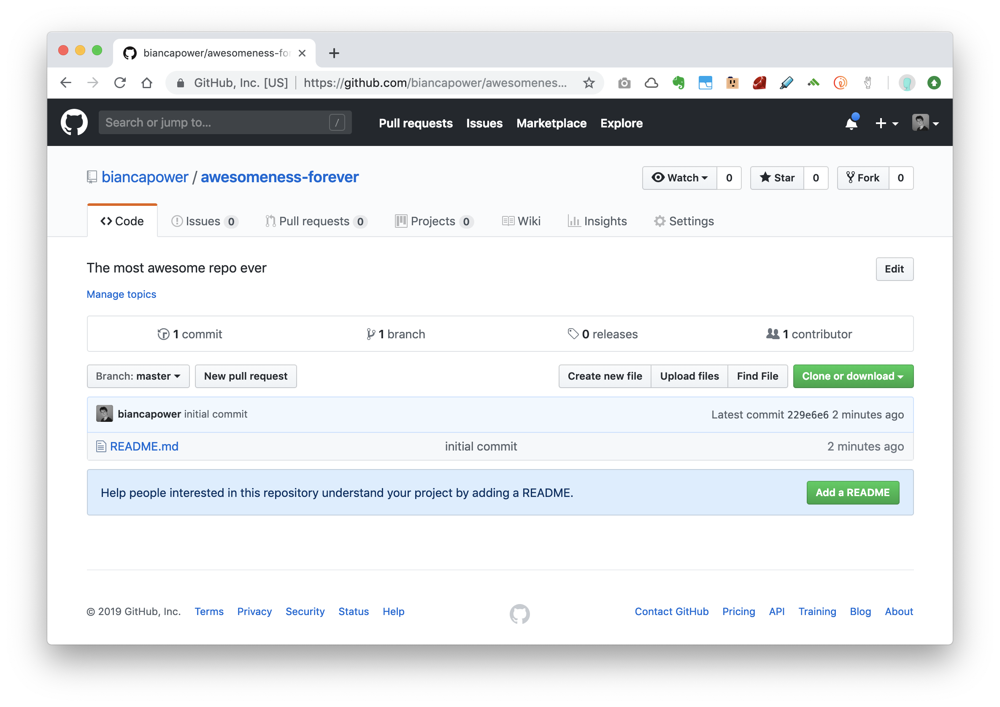

# GitHub Repo Creator

Create a GitHub repo with name, description, and privacy setting. Add the remote. Push to GitHub. All without leaving the terminal!

## Setup

1. Clone this repo, or download `githubrepo.sh` to your home directory
2. To allow your system to run a bash script you must change the file permissions. To do so run `chmod +x githubrepo.sh`


## Usage

Create a local repo as per usual (`git init`), add and commit changes, then when you are ready to create a remote GitHub repo, simply run the script from your repo folder:

```
~/githubrepo.sh
```


#### Script in action



#### Pushes to GitHub




